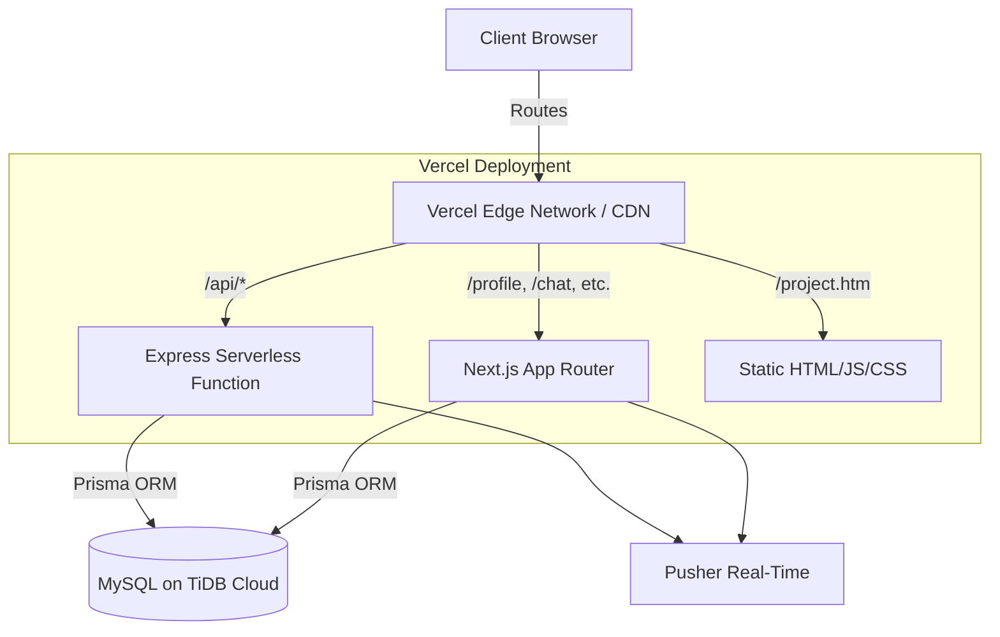

# ARCHITECTURE — TAKE ONE Nexus

> Deep technical architecture documentation for open-source contributors.

---

## 🏗️ System Overview

TAKE ONE Nexus uses a **dual-server, hybrid architecture**. It combines a Next.js React application with a standalone Express.js backend, deployed simultaneously on Vercel.

---

## 🖥️ Frontend Architecture

### 1. Next.js App (`src/app/`)
Handles complex, dynamic, and authenticated routes using the **App Router** (Next.js 14+). 
- **Server Components (RSC):** Used by default for SEO, performance, and secure data fetching.
- **Client Components:** Used only when interactivity (`useState`, `useEffect`) is required.
- **Key Routes:**
  - `/profile`: Cinematic user profiles and portfolios.
  - `/chat`: Real-time Pusher-powered messaging UI.
  - `/admin`: Role-based secure dashboard.

### 2. Static Pages (`public/`)
High-performance, vanilla HTML/JS/CSS pages. These form the primary public-facing interface.
- **`public/project.htm`:** The main landing page, containing the project feed and modals.
- **`public/crew.htm`:** The crew discovery directory.
- **Vanilla JS:** Logic is separated into domain-specific files inside `public/scripts/` (e.g., `api.js`, `modal.js`).

---

## ⚙️ Backend Architecture

### Express.js API (`server.js`)
The Express backend acts as the core API layer. On Vercel, it compiles down to a single Serverless Function using `@vercel/node`.

**Route Domains (`routes/`):**
- `/api/users`: Auth (Register, Login, JWT verification), Profile CRUD.
- `/api/scripts`: Portfolio/Project CRUD and search algorithms.
- **`/api/chat`**: Conversation creation, role management, and history retrieval.
- **`/api/tasks`**: Mission CRUD and role-based assignment tracking.
- **`/api/requests`**: Collaboration request state machine.

---

## 🗄️ Database Architecture

We use **MySQL** optimized for TiDB Cloud, managed entirely through **Prisma ORM**.

### Core Models (`prisma/schema.prisma`)
- **`User`**: Identity, credentials, creative roles, and earned credits.
- **`Script`**: The "Work" or "Portfolio" item. Holds `role_data` (JSON) allowing dynamic fields based on the creator's role.
- **`Conversation` & `ConversationMember`**: Relational structure supporting production roles (Director, Admin, Member) via an explicit junction table.
- **`Task`**: Tracking system for project "missions" with status (Todo, In Progress, Review, Done) and priority weighting.
- **`CollaborationRequest`**: A state-machine table tracking the status (Pending, Accepted, Rejected) of project invites.

---

## 🔐 Auth Flow

Authentication is fully stateless, relying on **JSON Web Tokens (JWT)**.

1. **Login:** Client sends credentials to `POST /api/users/login`.
2. **Verification:** Backend validates with `bcrypt` and generates a JWT.
3. **Storage:** The JWT is returned via a secure, `HttpOnly` cookie.
4. **Validation:** For protected routes, `middleware/auth.js` verifies the cookie signature. Next.js middleware utilizes `jose` for Edge-compatible JWT parsing.

---

## 💬 Real-Time Chat Flow

TAKE ONE Nexus uses **Pusher** to offload WebSocket connection management.

1. **Initialization:** When a user opens `/chat`, the frontend fetches historical messages via `GET /api/chat/messages/:id`.
2. **Subscription:** The client subscribes to a private Pusher channel: `private-conversation-<id>`.
3. **Dispatch**: User sends a message or task update via dedicated POST/PATCH endpoints.
4. **Broadcast**: The Express backend saves the record to MySQL, then triggers a Pusher event (e.g., `new-message` or `task-update`).
5. **Receive**: Connected clients receive the event and re-render appropriate UI segments (Transmission vs. Mission tabs).

---

## 📍 State Management

- **Next.js:** Relies heavily on Server Component data fetching. Client state is managed locally via `useState` and `useRef`. No global state managers (like Redux) are used to keep the bundle lean.
- **Vanilla JS:** Uses a module pattern, passing state explicitly between functions to avoid polluting the global `window` object.

---

## 🚀 Deployment Architecture

TAKE ONE Nexus is optimized for **Vercel**.
- **Build Step:** `prisma generate && next build`
- **Routing:** Handled entirely by `vercel.json` rewrite rules.
  - `/api/*` -> Routes to the Express serverless function.
  - `/` -> Rewrites to `/project.htm`.
  - Everything else -> Next.js App Router.

---

*This architecture is actively evolving. Please check the `ROADMAP.md` for our path toward microservices and mobile integration.*
