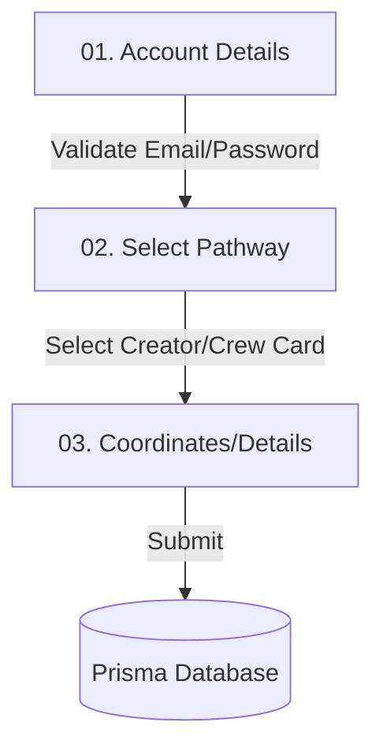

# 🛰️ Self-Onboarding & Interactive Walkthroughs

Take One Nexus implements a state-of-the-art onboarding UX designed to immediately conversion-rate-optimize the experience of guest visitors, turning raw landing page traffic into registered filmmakers.

---

## 📽️ 1. Interactive HUD Guide

The platform integrates a custom, lightweight vanilla JavaScript guided tour (`onboarding.js`) that spotlights key platform elements upon arrival.

### Technical Architecture

*   **File Locations**:
    *   Script: [onboarding.js](file:///Users/aarushgupta/Documents/Projects/take-one-nexus/public/scripts/components/onboarding.js)
    *   Styles: [onboarding.css](file:///Users/aarushgupta/Documents/Projects/take-one-nexus/public/styles/components/onboarding.css)
*   **Target Selection & Spotlights**:
    The tour calculates absolute coordinates dynamically via `.getBoundingClientRect()` and scrolls elements into center-focus. It overlays a dark spotlight backdrop mask (`nexus-tour-spotlight`) featuring a glowing neon border.
*   **Persistent State**:
    Saves a persistent state key (`take_one_tour_completed`) in the client's `localStorage` to avoid bothering returning users, but offers a bottom-right HUD FAB (`?`) enabling manual replay on demand.

### Guided Steps Index

| Transmission | Element Targeted | Title | Rationale |
| :---: | :---: | :---: | :---: |
| **01** | `header .logo` | **Nexus Hub** | Introduces the platform concept. |
| **02** | `#guestHeroActions` | **Choose Your Pathway** | Highlights the split Creator vs Crew routes. |
| **03** | `header nav a[href="#explore"]` | **Discover Projects** | Leads the guest to browsing scripts. |

## Critical Flow Note

Onboarding tasks can now be created from `/admin` with title, description, credits, category, and active state. Admin approval awards Nexus Credits and refreshes the leaderboard.
| **04** | `#navCrewLink` | **Crew Finder** | Explains direct specialty search. |
| **05** | `#loginBtn` | **Activate Your Signal** | Guides the guest to final registration. |

---

## 🎬 2. Multi-Step Registration Wizard

Instead of an intimidating, long single-form registration page, the modal features a dynamic 3-step wizard.

### Wizard Phases

1.  **Phase 01: Account Setup**
    *   Input Fields: *Full Name*, *Email Address*, *Password*, *Confirm Password*.
    *   Validations: Re-verifies valid email syntax and enforces matches between the password and confirmation password before enabling "Next Phase".
2.  **Phase 02: Choose Your Pathway**
    *   Interactive Cards: Hosts two prominent cards matching the visitor's core mission:
        *   **Creator Card** (🎬): For directors, writers, producers. Dynamically filters the *Core Role* select dropdown to display only creative leadership roles.
        *   **Crew Card** (🎥): For DPs, editors, sound designers. Filters the select dropdown to display production specialties.
    *   Role configuration and stage name preferences.
3.  **Phase 03: Geographic Coordinates**
    *   University name (FTII Pune autocomplete support) and city selection.
    *   Submits payload securely to the Express backend via JWT storage.

---

  
<i>Take One Nexus Onboarding Wiki • Designed for the Cinematic Future</i>

